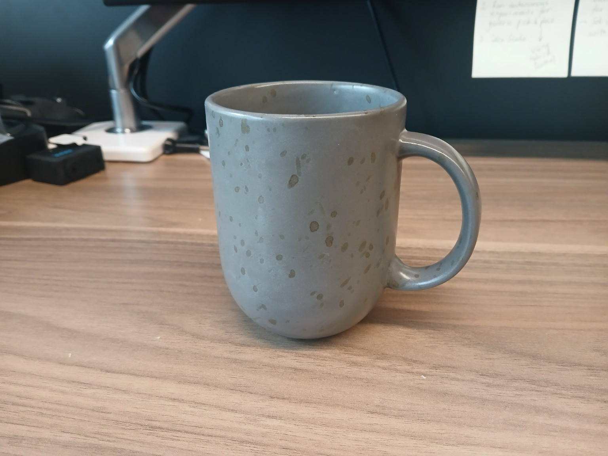
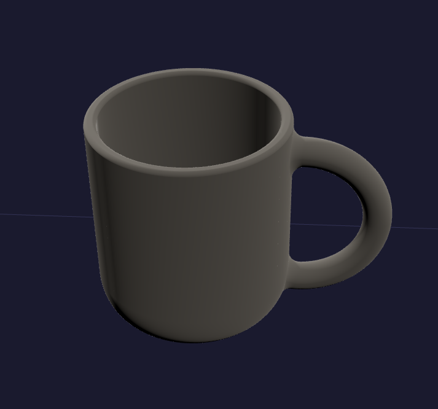
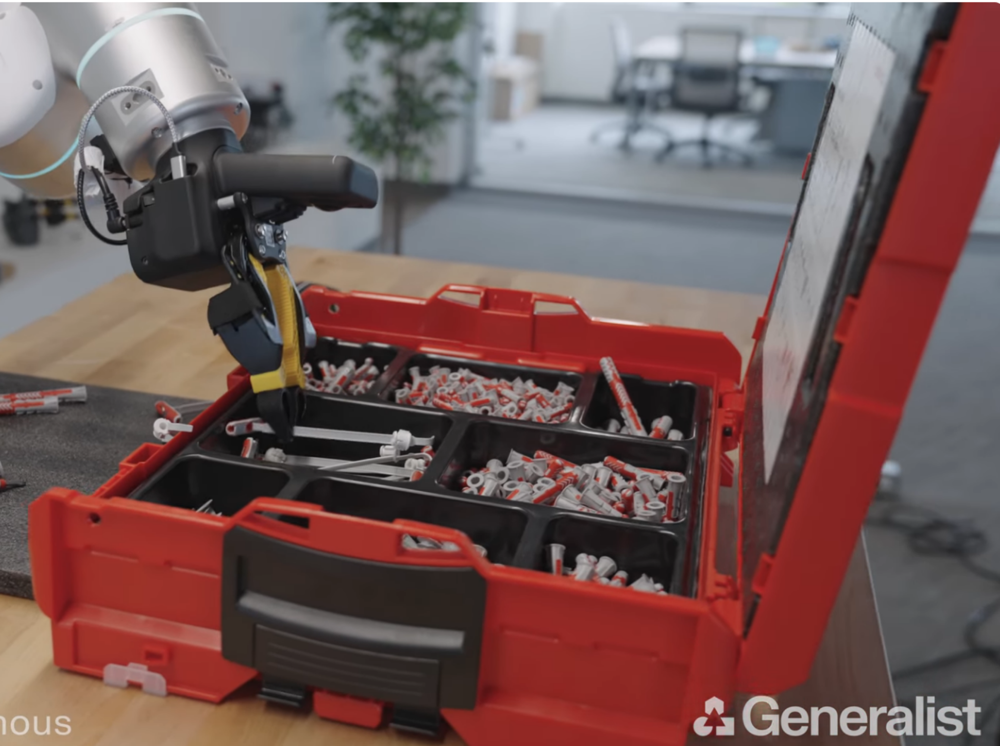
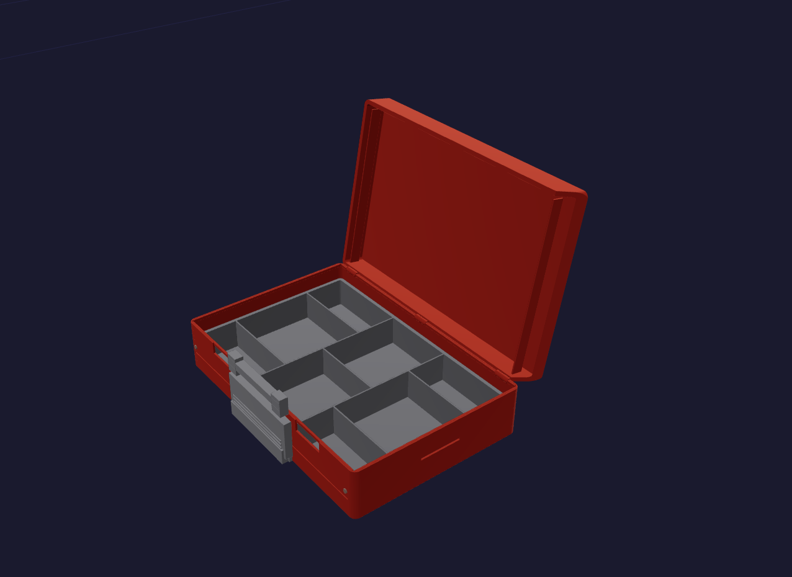
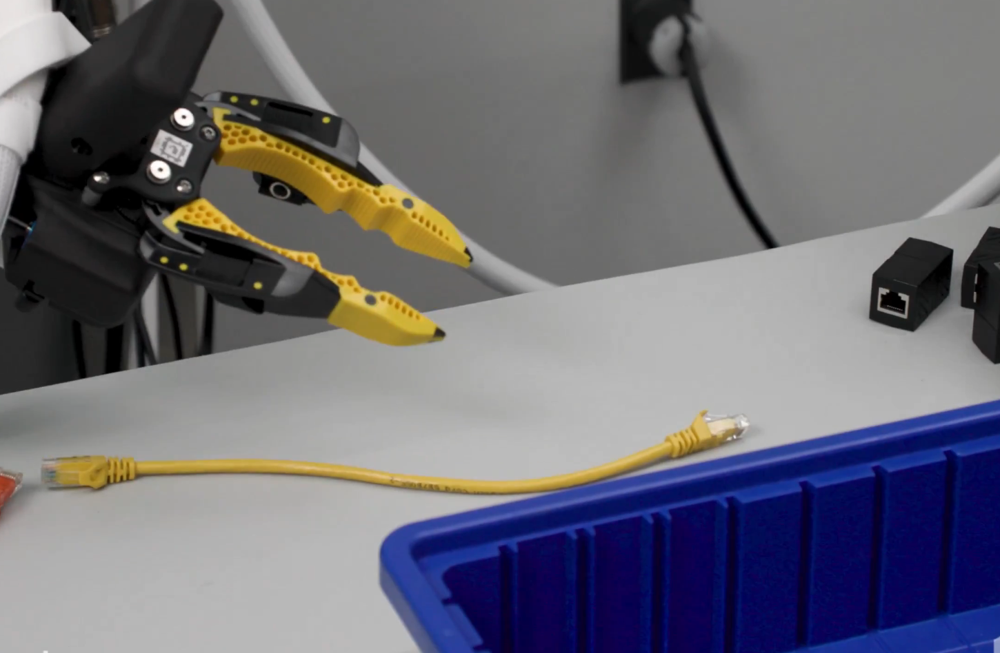
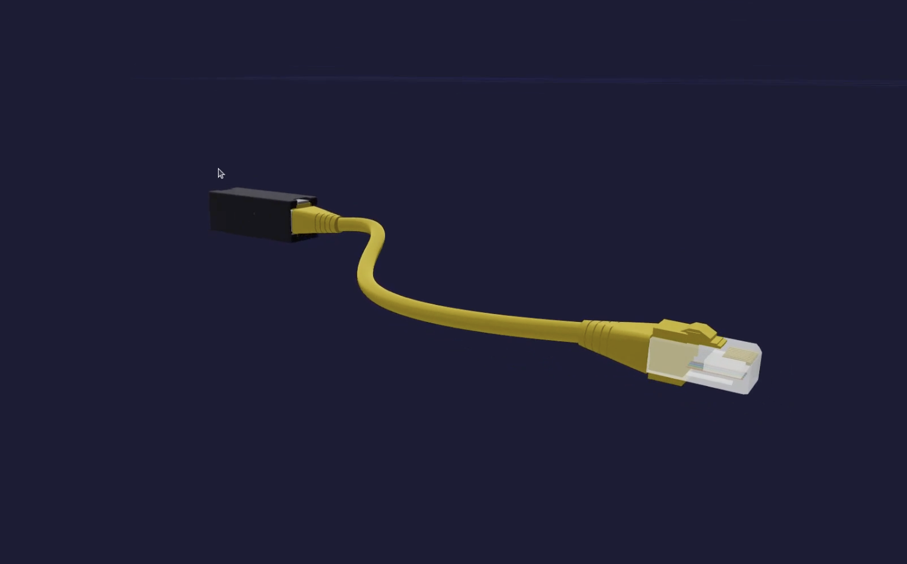

# claude-cad

Text-to-CAD prompts for [Build123d](https://github.com/gumyr/build123d), designed to generate detailed parametric 3D models from natural language descriptions.

Each prompt was written by studying a real-world object and capturing its geometry, dimensions, construction sequence, and material appearance in enough detail for a CAD LLM to reproduce it.

The CAD models were generated using the [`/render` skill](https://github.com/mfranzon/render/tree/main) for Claude Code.

## Starting prompt

Each of the prompts below was generated by giving Claude an image of the object and asking:

> Can you look carefully at the image of \<object\> and generate a prompt for Build123d so I can generate a CAD model?

## Overview

| Prompt file | Object |
|---|---|
| [build123d_mug_prompt.md](build123d_mug_prompt.md) | Speckled ceramic mug |
| [red_briefcase_cad_prompt.md](red_briefcase_cad_prompt.md) | Red parts briefcase / organizer |
| [build_123_d_ethernet_cad_prompt.md](build_123_d_ethernet_cad_prompt.md) | Yellow Ethernet patch cable + RJ45 coupler |

## Prompts

### Speckled Ceramic Mug

| Reference | CAD Result |
|:-:|:-:|
|  |  |

A stoneware-style coffee mug with a rounded bullet-shaped base, thick rim, and a large loop handle. Modeled as a revolved body with a swept handle.

[Full prompt](build123d_mug_prompt.md)

---

### Red Parts Briefcase / Organizer

| Reference | CAD Result |
|:-:|:-:|
|  |  |

A hard-plastic portable organizer briefcase with a hinged lid, grey carry-handle/latch assembly, and a removable 8-bin black internal tray. 42 parts total.

[Full prompt](red_briefcase_cad_prompt.md)

---

### Yellow Ethernet Patch Cable + RJ45 Coupler

| Reference | CAD Result |
|:-:|:-:|
|  |  |

A yellow Ethernet patch cable with transparent RJ45 male connectors on both ends and a female-to-female inline coupler. 74 named parts including contact pins, shield frames, and latch mechanisms.

[Full prompt](build_123_d_ethernet_cad_prompt.md)
